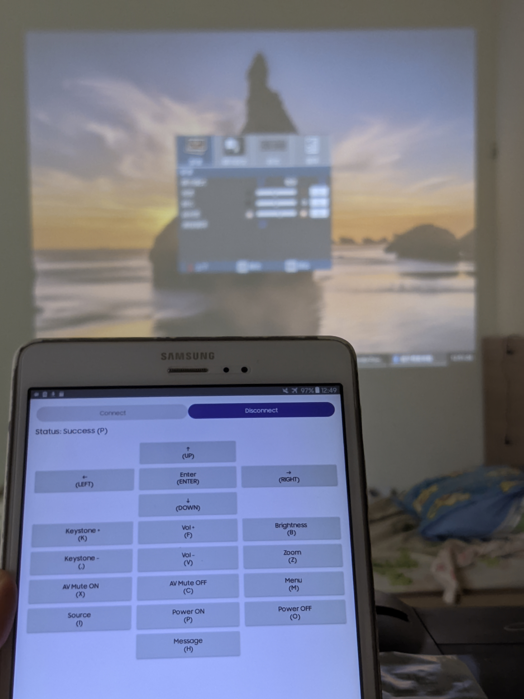
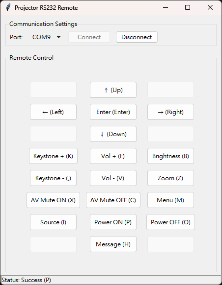
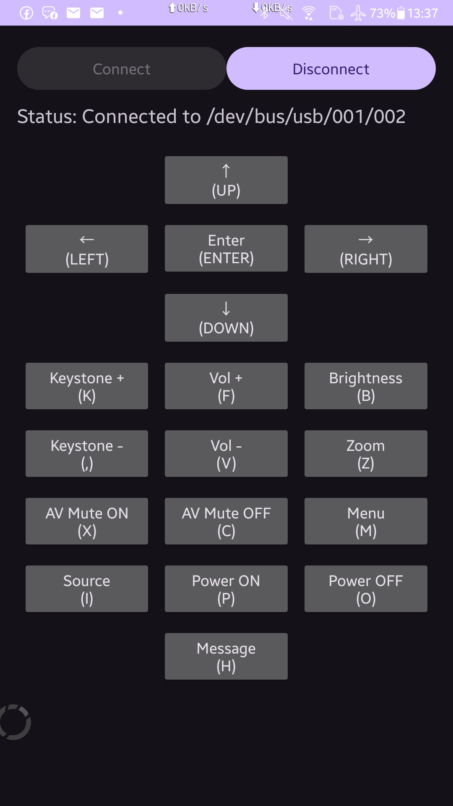

# Optoma-Serial-Remote
Optoma projector remote by RS232 interface, tested on EX556 projector
  
Note: This project contains mostly AI-generated code, which may contain some unfixed bugs.
  
## Python version
* Use the `python_remote/rs232_remote.py`
* This version is using the Windows's keycode mapping, need a little fix to fit on another operating system
* Can use the pre-built version under the release use the Pyinstaller with Python 3.10, tested under Windows 11.
* You can rebuilt by yourself by tools like Pyinstaller or others program.
  
## Android version
* Download the pre-built debug version under the release, can run on the device newer than Android 6.0
* If you connect the USB to RS232 dongle, the confirm dialog should be pops out to let you can use the remote program immediately.
* Android version built use the Android Studio 2025.3.1 Patch 1
  
## Gallery

